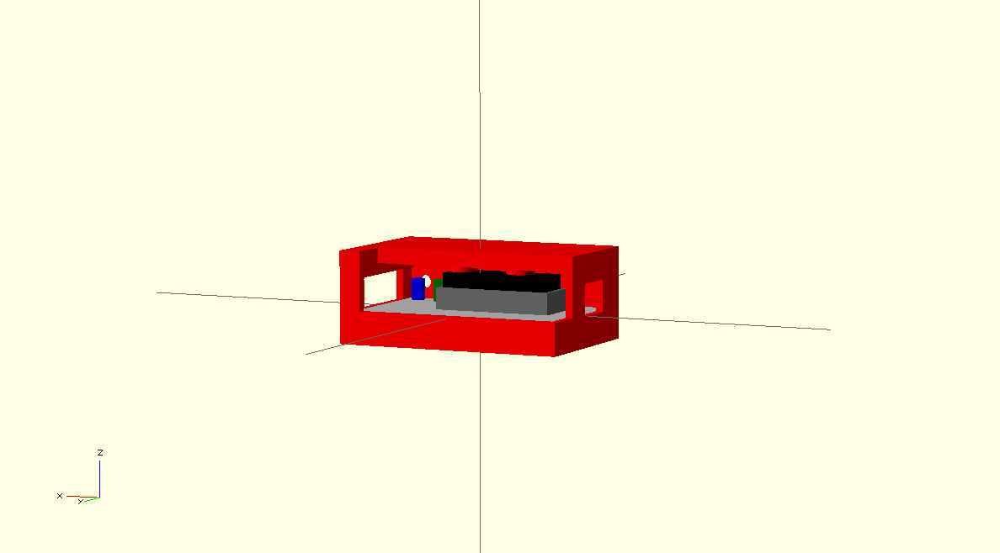
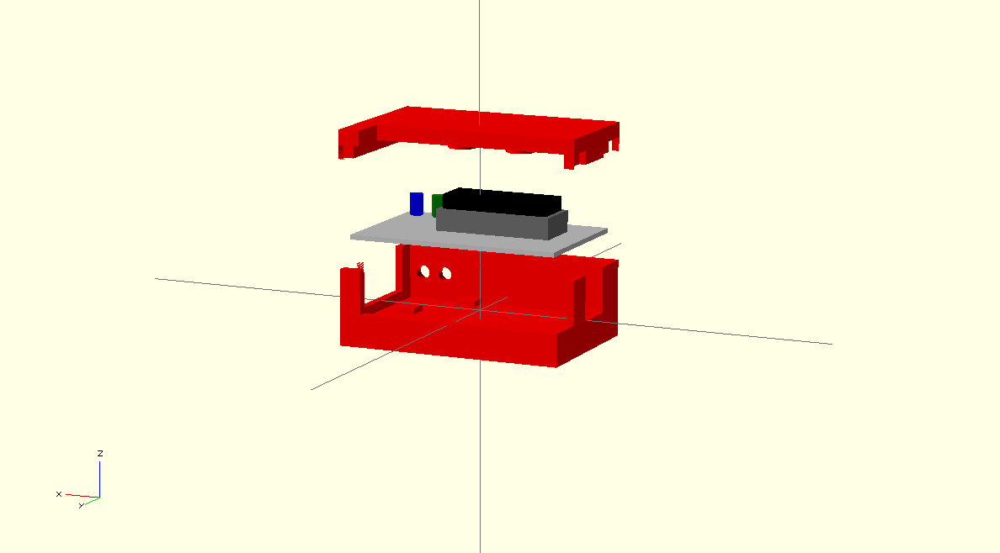

Bric(k)-o-lage - smart bricks the "bricolage" way
sw@kaltpost.de
http://gpio.kaltpost.de/

Introduction
------------

With this project I try to create different "smart" bricks which will interconnect with some other well 
known brick systems (e.g. Like LEGO). By "smart" bricks, bricks are meant which are able to perform a certain 
functionality like driving LEDs, detecting button presses, control DC motors or servos, read sensors 
and so on. This "smart" bricks (or "slave" bricks) are then connected to a "master" brick which allows 
to organize the functionality of the "smart" bricks into a more complex system. 

This project aims to provide the plans for the hardware (like schmatics, PCBs and STL for 3D printing), 
als well as the firmware for both, the "slace" bricks and the "master" brick.

Currently the following bricks are planned

__Master Brick__

* Uses a 8Devices Carambola SoC
* Runs Linux
* Accessible through WiFi
* Allows "slave" bricks to be connected through I2C

==> Work on this brick already started

__Slave Bricks__

DIO Brick (Digitial IO)

* Uses a MSP430G2553 from TI
* Runs custom firmware
* Connects to master brick through I2C
* 4 digital outputs
* 4 digital inputs
* 2 status LEDs
* Serial RX/TX for debugging

==> Work on this brick already started

DCM Brick (DC Motor Control)

* Uses a MSP430G2553 from TI
* Runs custom firmware
* Connects to master brick through I2C
* Control 2 DC motors (direction, speed)
* ...

==> Not started yet

SER Brick (Servo Control)

* Uses a MSP430G2553 from TI
* Runs custom firmware
* Connects to master brick through I2C
* Control 2 servos 
* ...

==> Not started yet

SEN Brick (Sensor Control)

* Uses a MSP430G2553 from TI
* Runs custom firmware
* Connects to master brick through I2C
* Query verious sensors like ultra-sonic, IR, ... 
* ...

==> Not started yet

Images
------

DIO Brick

